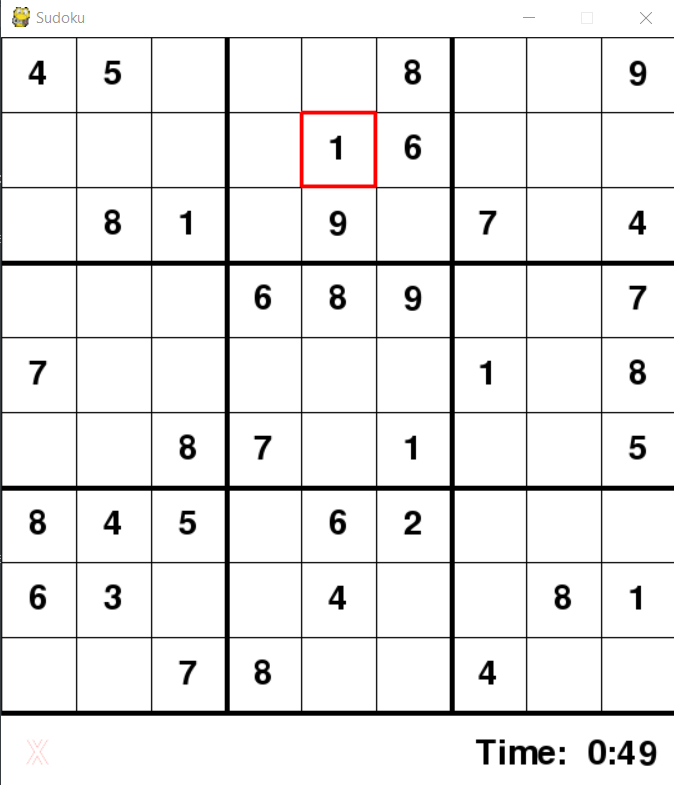

# sudoku-solver
 This is sudoku solver based on alogorithms which broadly generate a random sudoku puzzle and solve it. User can also solve the puzzle
 The instructions will get you a copy of the project up and running on your local machine.

## Screenshot

## Prerequisites
* Python
* pygame
* Data Structures
* Python GUI

## Instruction
* The user can set the difficulty of the puzzle and the solving speed of the algorithm on initiation by running solver.py
* Difficulty Levels available are - Easy, Moderate, Hard. According to these levels a puzzle will be generated by random_grid_generator.py
* Solving Speed
* User can either solve the puzzle by themselves or can press the Spacebar for the algorithm to solve it for them

## Built With
* Python
* pygame

## Authors
* **Advait Sharma**
